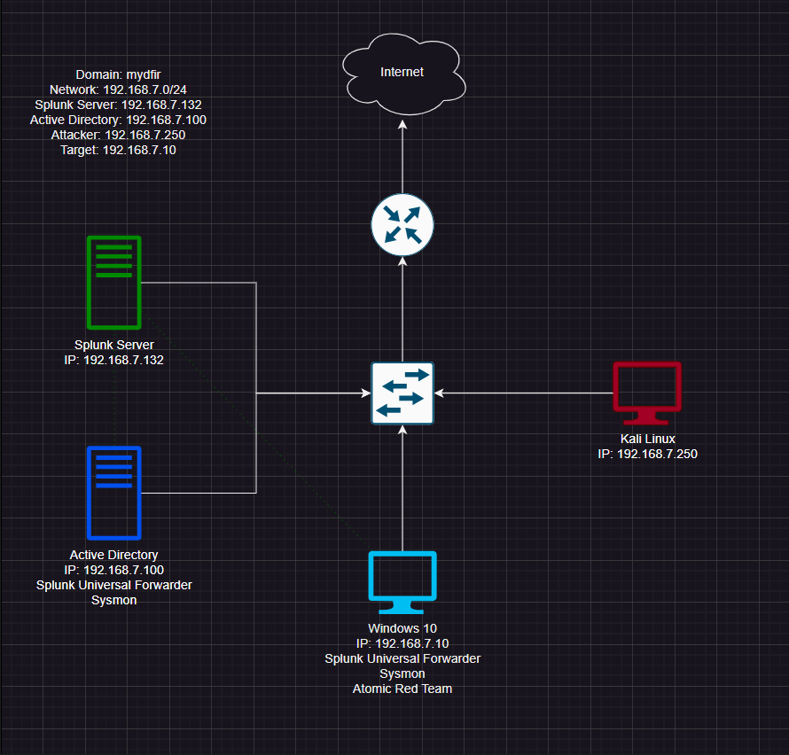
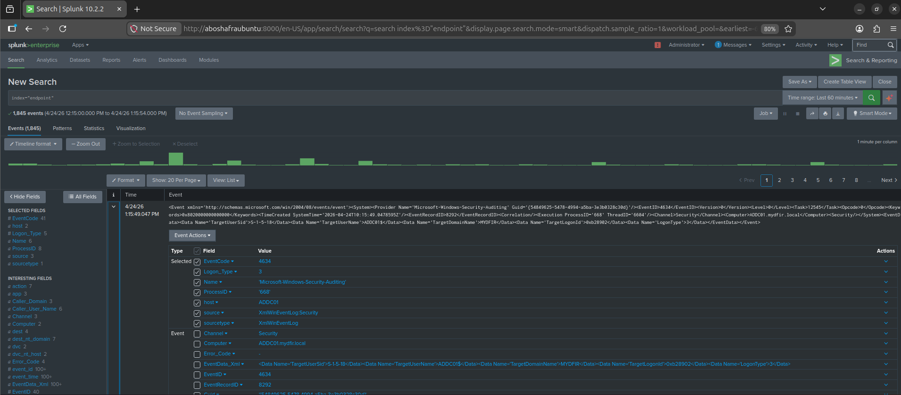
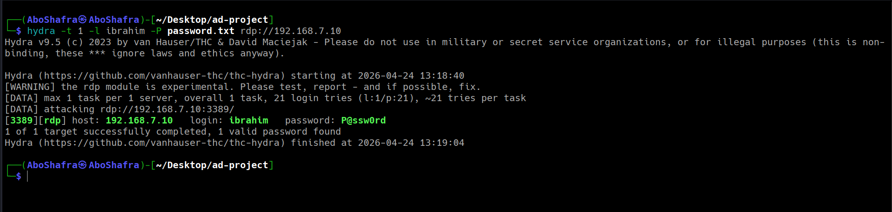
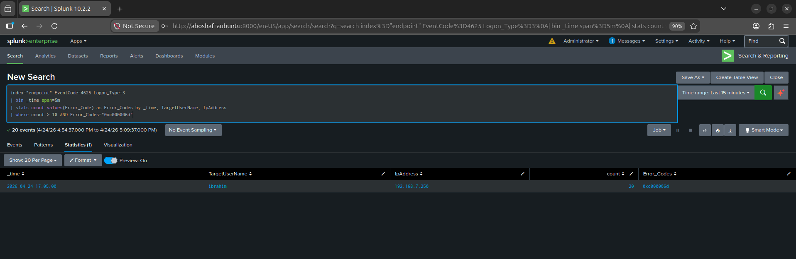
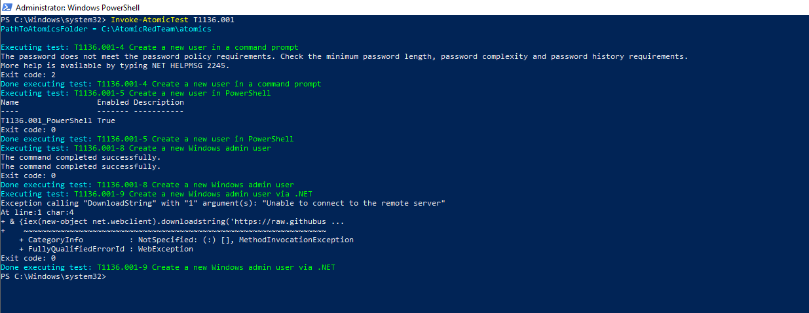
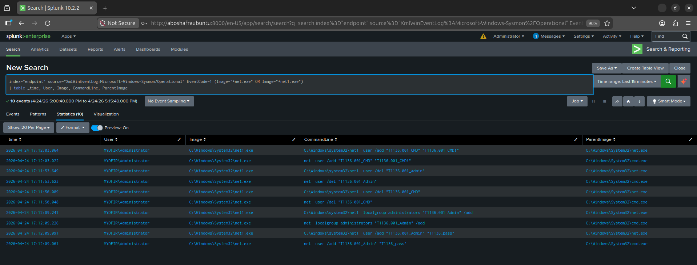

# Enterprise Active Directory & SIEM Threat Hunting Lab

## 📝 Executive Summary
This project involved engineering a virtualized enterprise Active Directory environment integrated with a Splunk SIEM to simulate and detect real-world adversarial activity. The environment generated telemetry from controlled attacks, which was mapped to the MITRE ATT&CK framework to develop high-fidelity, threshold-based detection rules. The end-to-end SOC pipeline covers infrastructure deployment, log pipeline engineering, threat simulation, and automated response strategies.

---

## 🧠 Skills Learned
* **Lab Engineering & Virtualization:** Building an isolated enterprise network using VMware to safely execute adversarial simulations.
* **Log Pipeline Design:** Implementing end-to-end telemetry ingestion using Sysmon and Splunk Universal Forwarders.
* **Data Normalization & CIM Compliance:** Mastering Splunk Add-ons to parse raw XML event data into Common Information Model (CIM) compliant fields.
* **Detection Engineering:** Developing custom, threshold-based SPL queries to identify anomalies and high-volume authentication failures.
* **Threat Hunting & Analysis:** Correlating Windows Event IDs with Sysmon process lineage to identify persistence and privilege escalation.
* **Incident Response & Triage:** Formulating response workflows including containment, account disablement, and source IP blocking.
* **Technical Troubleshooting:** Resolving complex engineering roadblocks such as DNS interception and SIEM time-drift.

---

## 🛠️ Tools & Technologies
* **Hypervisor:** VMware Workstation (Isolated Vmnet7 network).
* **SIEM / Indexer:** Splunk Enterprise (Running on Ubuntu Server 22.04 LTS).
* **Domain Controller:** Windows Server 2022 (Active Directory Domain Services).
* **Endpoint Telemetry:** Sysmon (Olaf Hartong's configuration) & Windows Security Logs.
* **Adversarial Frameworks:** Kali Linux, Hydra (Brute-force), and Atomic Red Team.

---

## 🏗️ Logical Architecture
The lab operated within a custom isolated virtual network (192.168.7.0/24) to safely monitor malicious activity.

* **Domain Controller (ADDC01):** 192.168.7.100
* **Target Workstation (Windows 10):** 192.168.7.10
* **Splunk Server:** 192.168.7.132
* **Attacker System (Kali Linux):** 192.168.7.250

---

## 🛡️ The SOC Pipeline: Data Engineering
To ensure high-visibility threat hunting, I engineered a robust log ingestion pipeline:
1. **Telemetry Generation:** Deployed Sysmon across endpoints to capture granular process creation and network connections.
2. **Log Transport:** Configured Splunk Universal Forwarders to route logs securely over TCP port 9997.
3. **Normalization:** Operationalized the Splunk Add-on for Microsoft Windows to ensure CIM compliance.

---

## ⚔️ Attack Simulation & Detection Logic

### 1. RDP Brute Force (Credential Access - T1110.001)
* **Attack:** Targeted RDP brute-force against the domain account `ibrahim` using Hydra.
* **Detection Logic:** Engineered an SPL query to detect high-volume authentication failures (EventCode 4625) within a 5-minute threshold.
* **Findings:** The SIEM successfully correlated error code `0xc000006d` (bad authentication) originating from the attacker's IP 192.168.7.250.

### 2. Local Account Creation (Persistence - T1136.001)
* **Attack:** Automated simulation via Atomic Red Team to create rogue administrator accounts.
* **Detection Logic:** Monitored Sysmon Event ID 1 (Process Creation) to hunt for `net.exe` command-line arguments.
* **Findings:** Extracted exact command-line arguments: `net user /add "T1136.001_Admin"` and identified `cmd.exe` as the parent process.

---

## 🚀 Incident Response & Performance
* **Triage:** Validated spikes in EventCode 4625 and confirmed sustained, repeated attempts from a single source.
* **Containment:** Formulated strategies to block source IP 192.168.7.250 and disable compromised accounts.
* **Performance Metric:** Achieved a **Time to Detect (TTD) of ~2 minutes**.

---

## 🔧 Engineering Challenges
* **Transparent DNS Sinkholing:** Resolved installation failures for Atomic Red Team by hardcoding authoritative IPs into the Windows hosts file.
* **SIEM Pipeline Time-Drift:** Fixed visibility issues caused by NTP desynchronization between the hypervisor and the domain clocks.

---

## 📂 Project Documentation
For a deep dive into the technical architecture, attack timelines, and mitigation strategies, please refer to the full report:

👉 **[Download Full Project PDF (Whitepaper)](Enterprise_Active_Directory__SIEM_Threat_Hunting_Lab.pdf)**

---
*Developed by Ibrahim Abdulsalam Alshami | 2026*
